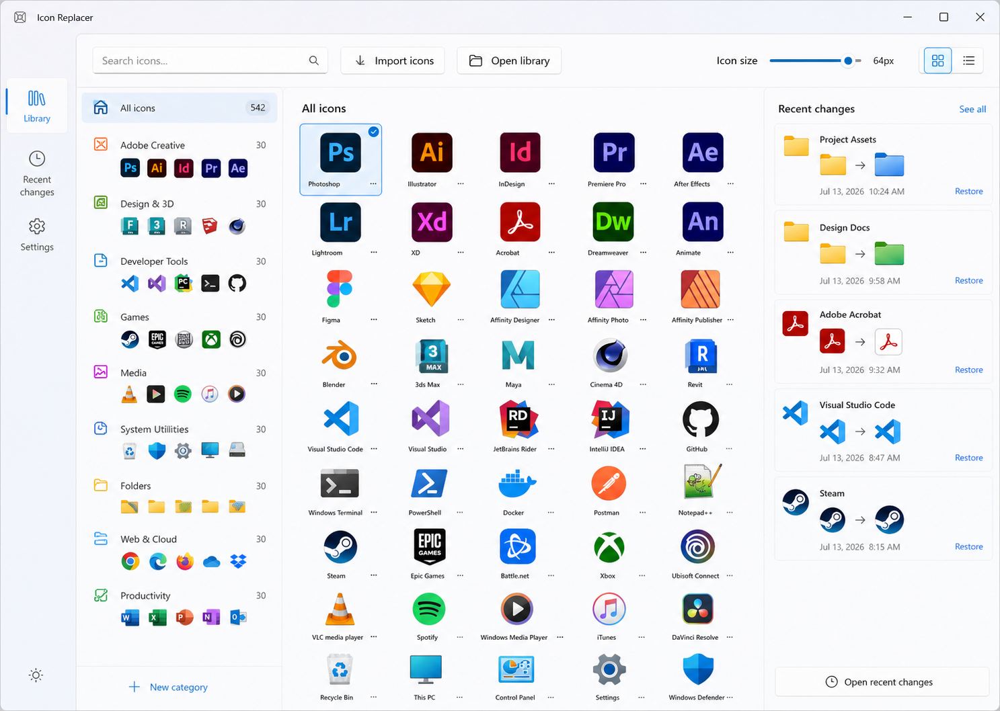

# Icon Replacer

Give your Windows folders and shortcuts the icons you want—without digging through system settings.

## What you can do

- Change the icon of a folder or `.lnk` shortcut from File Explorer.
- Choose icons from a visual gallery.
- Import your own `.ico` files and organize them into collections.
- Restore a previous icon when you change your mind.
- Use the Windows 11 menu or **Show more options**.

## Download

**[Download Icon Replacer v1.0.0-rc.1](https://github.com/gvastethecreator/icon-replacer/releases/tag/v1.0.0-rc.1)**

This is a release candidate for Windows x64. It uses a development certificate, so Windows requires a one-time trust step before installation. Follow the [short download and installation guide](docs/operations/RELEASE.md) to verify and install it safely.

## How to use it

1. Open Icon Replacer from the Start menu to browse or import icons.
2. Right-click a folder or shortcut in File Explorer.
3. Choose **Change icon...** or select an icon from **Icon collections**.
4. Open the app's **Recent** page when you want to restore a change.

Your icon library stays on your computer in `%USERPROFILE%\.icons`.

## Requirements

- Windows 10 version 1809 or later, x64.
- Windows 11 to use the modern File Explorer menu; Windows 10 uses the classic menu.
- `.ico` files for custom imports.

## Release status

The main experience is working and covered by automated tests, but this is not the final stable release yet. Clean-uninstall validation, additional accessibility checks, and the remaining File Explorer scenarios are still in progress.

See [what changed](CHANGELOG.md) or report a problem in [GitHub Issues](https://github.com/gvastethecreator/icon-replacer/issues).

## For contributors

Developer setup, architecture, testing, packaging, and security details live in the [documentation index](docs/INDEX.md) and [contributing guide](CONTRIBUTING.md).

## License

No source-code license has been selected yet. The repository is public for inspection, but it does not currently grant permission to reuse, modify, or redistribute the source code.
