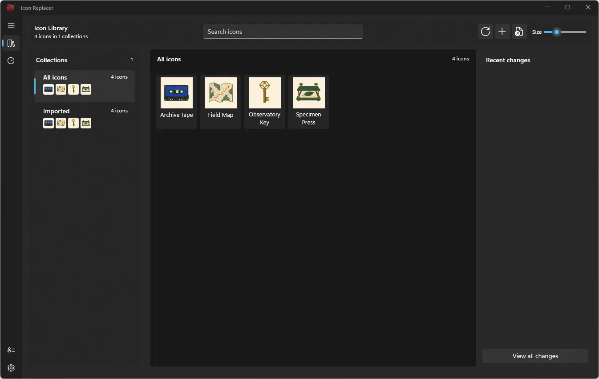
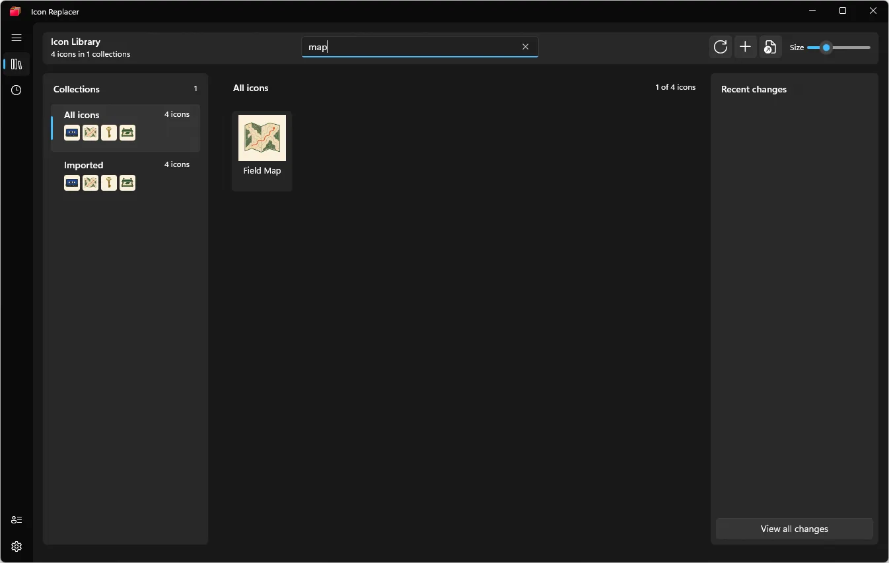
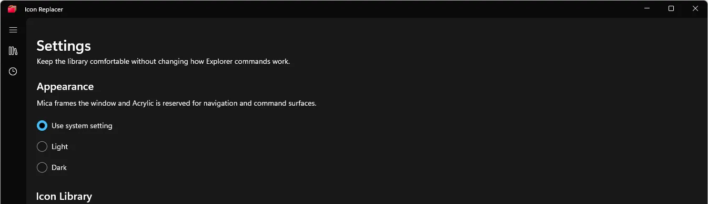
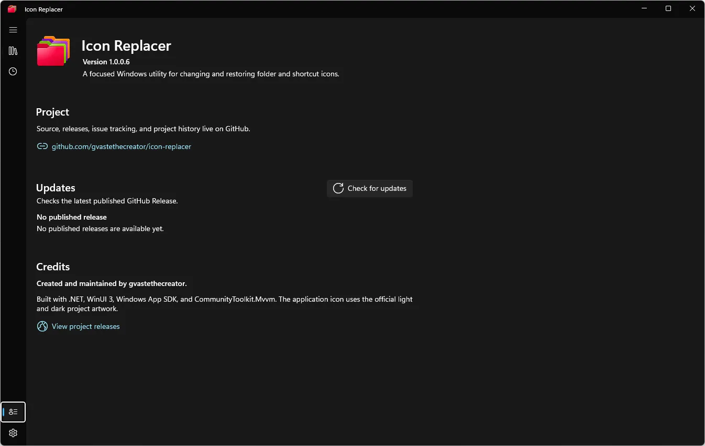

<p align="center">
  <picture>
    <source media="(prefers-color-scheme: dark)" srcset="https://shieldcn.dev/header/document.svg?title=Icon+Replacer&subtitle=Change+and+restore+Windows+folder+icons+without+the+registry+detour&logo=windows&theme=blue&align=center&mode=dark" />
    
  </picture>
</p>

<p align="center">
  <a href="https://github.com/gvastethecreator/icon-replacer/actions/workflows/ci.yml"></a>
  <a href="https://gvastethecreator.github.io/icon-replacer/"></a>
  <a href="https://dotnet.microsoft.com/"></a>
  <a href="https://www.microsoft.com/windows"></a>
  <a href="https://github.com/gvastethecreator/icon-replacer/stargazers"></a>
</p>

A focused Windows utility for changing folder and shortcut icons from File Explorer, keeping a reusable local icon library, and restoring earlier choices.

[Project site](https://gvastethecreator.github.io/icon-replacer/) · [Download the release candidate](https://github.com/gvastethecreator/icon-replacer/releases/tag/v1.0.0-rc.1) · [Report an issue](https://github.com/gvastethecreator/icon-replacer/issues)

- Change a folder or `.lnk` shortcut from the Windows 11 menu or **Show more options**.
- Browse and import local `.ico` files without sending them anywhere.
- Organize icons in one-level collections under `%USERPROFILE%\.icons`.
- Review recent changes and restore the previous icon safely.
- Keep normal use per-user: no administrator access is required.

## Product tour

| Icon Library | Filtered search |
| --- | --- |
|  |  |
| **Appearance** | **About and updates** |
|  |  |

The example icons in these screenshots were generated for the documentation session and are not bundled with the app.

## Download

**[Download Icon Replacer v1.0.0-rc.1](https://github.com/gvastethecreator/icon-replacer/releases/tag/v1.0.0-rc.1)**

This is an x64 release candidate, not a stable release. It uses a development certificate, so Windows needs a one-time trust step before installation. Follow the [download and installation guide](docs/operations/RELEASE.md) to verify the package hash, trust the certificate, and install it safely.

Requirements:

- Windows 10 version 1809 or later, x64.
- Windows 11 for the modern File Explorer menu; Windows 10 uses the classic menu.
- Local `.ico` files for custom imports.

## First minute

1. Open Icon Replacer from the Start menu.
2. Import a few `.ico` files or open the local Icon Library.
3. Right-click a folder or shortcut in File Explorer.
4. Choose **Change icon...** or pick an entry from **Icon collections**.
5. Open **Recent** when you want to restore an earlier icon.

## Build from source

Install the .NET 10 SDK, Visual Studio 2022 Build Tools with the Windows SDK and C++ workload, and the `winapp` CLI. Then run:

```powershell
dotnet restore IconReplacer.slnx --locked-mode
dotnet test tests\IconReplacer.Core.Tests\IconReplacer.Core.Tests.csproj --configuration Release --no-restore
.\BuildAndRun.ps1 src\IconReplacer.App\IconReplacer.App.csproj -SkipRun /p:Configuration=Release /p:Platform=x64
```

Architecture, packaging, testing, security, and release proof live in the [documentation index](docs/INDEX.md). Contributor expectations are in [CONTRIBUTING.md](CONTRIBUTING.md).

## Microsoft Store preparation

The Store release is a separate x64 package channel with an exact Partner Center identity, Store-managed update policy, package validation, Explorer/COM lifecycle matrix, bilingual listing and privacy material, certification notes, and release evidence.

See:

- [Microsoft Store submission runbook](docs/store/README.md)
- [Store listing source](docs/store/LISTING.md)
- [Certification notes](docs/store/CERTIFICATION-NOTES.md)
- [Release evidence template](docs/store/RELEASE-EVIDENCE-TEMPLATE.md)
- [Privacy policy](PRIVACY.md)
- [Source-license decision](docs/store/LICENSE-DECISION.md)

The final Store build is deliberately blocked until Icon Replacer is reserved in Partner Center and the exact identity is applied. The first Store architecture remains x64 because the native Explorer extension and its lifecycle evidence must be produced separately for every architecture.

The Store build does not contact GitHub Releases for updates. The existing development-certificate release candidate remains a distinct evaluator channel and is not the stable Store package.

## Release status

The core icon engine, restore path, WinUI app, command host, and Explorer extension are implemented and covered by automated tests. Stable-release readiness remains open until clean install, update, uninstall, Explorer modern/classic scenarios, accessibility, Store listing/privacy, and source-license decisions have complete evidence.

## Support the project

<p>
  <a href="https://github.com/sponsors/gvastethecreator/"></a>
  <a href="https://ko-fi.com/gvaste"></a>
  <a href="https://x.com/gvastebb"></a>
</p>

## License

No source-code license has been selected yet. The repository is public for inspection, but it does not currently grant permission to reuse, modify, or redistribute the source code. The options and required follow-up are documented in [the Store license-decision record](docs/store/LICENSE-DECISION.md).
